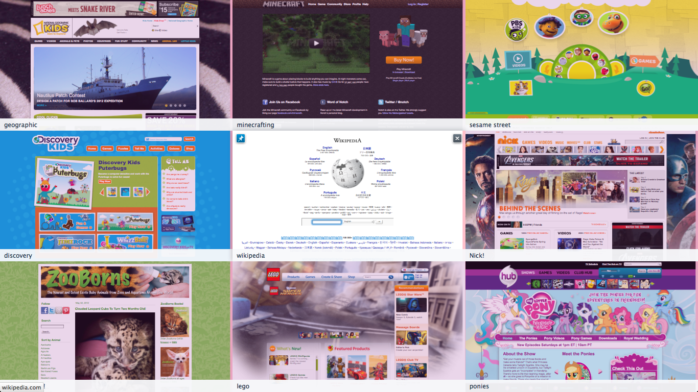

Puggle - A Safe, Simple Browser 
=================================

Features 
-------------

*   walled garden - white list of allowed sites
*   no tabs.  Single history
*   no location or search bar!

Screenshots
--------------

Other ideas
-------------

*   adblocking
*   administrative ui?

Bugs and contacts
--------------------

bugs:  https://github.com/gregglind/puggle/issues

contacts:  irc.mozilla.org#ur   or gregg.lind AT mozilla.com

Manifesto
------------

Good contributions come from everywhere!  Including from you!  (Without regard to your citizenship, native language,
race, gender, sexuality, physical ability, age, neurochemistry, and many other traits).  

<Up>
